Every coder thinks they can be a product manager and designer. Every product manager thinks they can be a coder and designer. Every designer thinks they can be a coder and product manager. Each one is somehow correct. Reality is that AI offers a boost to base skills: the taste of art, the rigor of logic, the clarity of scope.

# 🤔 Problem

The product triangle has three corners: PM, Engineer, Designer. For years we treated them as silos. Handoffs. Tickets. "That's not my job." The friction is real: engineers ship without user empathy, designers mock up without feasibility, PMs spec without technical depth.

The tension comes from a shared truth: each role *does* have overlap with the others. A good engineer has product sense. A good designer understands implementation tradeoffs. A good PM can sketch flows and read code. The gap was never "can they?" but "how far can they go without the base?"

# 🛠️ Solution

AI does not replace expertise. It amplifies it. The model gives you a boost to whatever base you already have. If you have none, you get something. If you have some, you get good. If you have a lot, you get state-of-the-art.

The progression is the same for every corner of the triangle.

```mermaid
%%{init: {'theme':'base', 'themeVariables': { 'primaryColor':'#e8e2d6', 'primaryTextColor':'#161614', 'primaryBorderColor':'#284a4a', 'lineColor':'#67665f', 'secondaryColor':'#f1ebde', 'tertiaryColor':'#e6dcc6', 'background':'#f1ebde', 'mainBkg':'#e8e2d6', 'secondBkg':'#e6dcc6', 'border1':'#284a4a', 'border2':'#67665f', 'arrowheadColor':'#284a4a', 'fontFamily':'Inter, system-ui, sans-serif' }}}%%
flowchart LR
    subgraph Dev["🧑‍💻 Developer"]
        direction TB
        D1([Not dev + AI]) --> D1O[Some code]
        D2([Developer]) --> D2O[Some code]
        D3([Developer + AI]) --> D3O[Good code]
        D4([10x dev + AI]) --> D4O[State-of-the-art code]
    end

    subgraph Des["🎨 Designer"]
        direction TB
        A1([Not designer + AI]) --> A1O[Some design]
        A2([Designer]) --> A2O[Some design]
        A3([Designer + AI]) --> A3O[Good design]
        A4([10x designer + AI]) --> A4O[State-of-the-art design]
    end

    subgraph PM["🏢 Product manager"]
        direction TB
        P1([Not manager + AI]) --> P1O[Some project]
        P2([Manager]) --> P2O[Some project]
        P3([Manager + AI]) --> P3O[Good project]
        P4([10x manager + AI]) --> P4O[State-of-the-art project]
    end

    classDef some fill:#e6dcc6,stroke:#67665f,color:#161614
    classDef good fill:#284a4a,stroke:#284a4a,color:#f1ebde
    classDef state fill:#3d6b6b,stroke:#284a4a,color:#f1ebde
    class D1O,D2O,A1O,A2O,P1O,P2O some
    class D3O,A3O,P3O good
    class D4O,A4O,P4O state
```

The pattern holds: AI raises the floor and the ceiling. Your base skill is the multiplier.

# 🧪 Example

A designer who has never shipped code can now prompt their way to a working prototype. It will not be production-grade, but it will be *something*. A developer with no design training can generate layouts and iterate until one feels right. A PM can draft specs, user stories, and even rough technical approaches without waiting for engineering.

The triangle does not collapse. Specialists still exist. But the handoffs shrink. The designer can speak to the engineer in implementation terms. The engineer can push back on design with real constraints. The PM can prototype flows instead of writing walls of text. Everyone reaches further because AI fills the gap between "I have a vague idea" and "I have something to show."

# 🚀 Take it further

- **Hire for base, not silos:** Look for people with curiosity across the triangle. A designer who tinkers with code. An engineer who cares about users. A PM who can read a PR. AI will amplify that curiosity.
- **Reduce handoff tax:** Let people prototype in the adjacent roles. The designer's Figma-to-code experiment is not wasted; it informs the real implementation. The engineer's quick UI mock is not a threat; it accelerates alignment.
- **Protect judgment:** AI gives you output. You still decide what to ship, what to cut, and what to refine. The 10x in each role is the one who knows when the AI output is wrong.
- **Calibrate expectations:** "Some" is fine for exploration. "Good" is the bar for shipping. "State-of-the-art" is rare and worth celebrating. Do not confuse the three.

The triangle is merging. Not because roles disappear, but because the gaps between them are finally bridgeable. Build your base, then let AI extend your reach.
